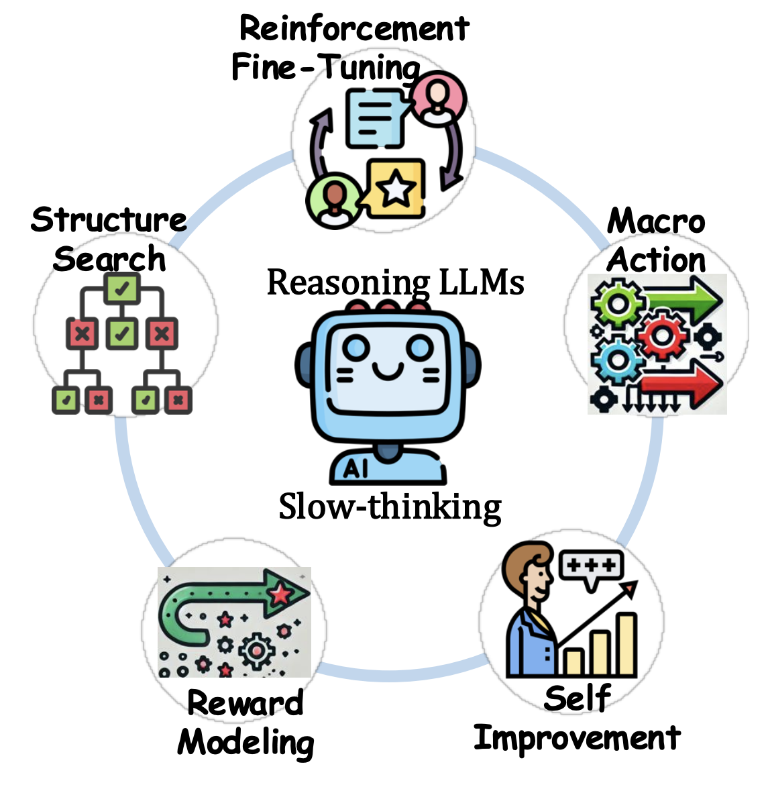
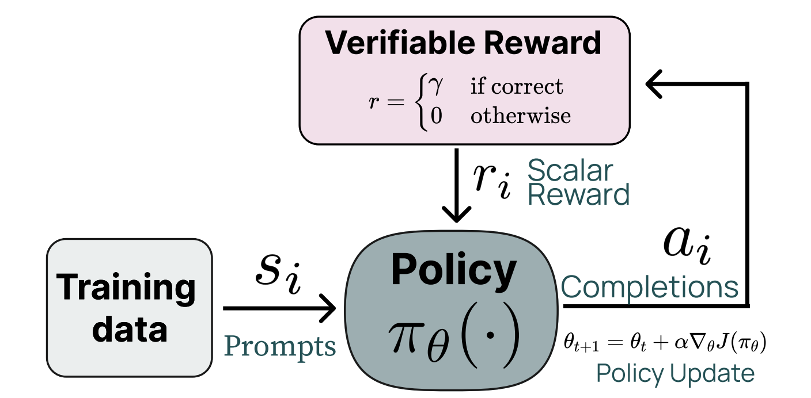

# Awesome RLVR — Reinforcement Learning with **Verifiable** Rewards

[](https://github.com/opendilab/awesome-RLVR/stargazers)
[](https://github.com/opendilab/awesome-RLVR/network/members)
[](https://github.com/opendilab/awesome-RLVR/graphs/contributors)
[](./LICENSE)

> A curated collection of surveys, tutorials, codebases and papers on  
> **Reinforcement Learning with Verifiable Rewards (RLVR)**—  
> a rapidly emerging paradigm that aligns both LLMs *and* other agents through  
> **objective, externally verifiable signals.**
<!-- > external verification, self-consistency and iterative self-improvement. -->

<!-- <p align="center">
  
  <br/>
  <em>
    Core techniques powering reasoning LLMs, where verifiable rewards are pivotal.  
    (Figure taken from <a href="https://arxiv.org/pdf/2502.17419">
    “From System 1 to System 2: A Survey of Reasoning Large Language Models”</a>)
  </em>
</p> -->

<p align="center">
  
  <br/>
  <em>
    An overview of how Reinforcement Learning with Verifiable Rewards (RLVR) works.  
    (Figure taken from <a href="https://arxiv.org/pdf/2411.15124">
    “Tülu 3: Pushing Frontiers in
Open Language Model Post-Training”</a>)
  </em>
</p>

## Why RLVR?

RLVR couples reinforcement learning with **objective, externally verifiable signals**, yielding a training paradigm that is simultaneously powerful and trustworthy:

* **Ground-truth rewards** – unit tests, formal proofs, or fact-checkers provide binary, tamper-proof feedback.  
* **Intrinsic safety & auditability** – every reward can be traced back to a transparent verifier run, simplifying debugging and compliance.  
* **Strong generalization** – models trained on verifiable objectives tend to extrapolate to unseen tasks with minimal extra data.  
* **Emergent “aha-moments”** – sparse, high-precision rewards encourage systematic exploration that often yields sudden surges in capability when the correct strategy is discovered.  
* **Self-bootstrapping improvement** – the agent can iteratively refine or even generate new verifiers, compounding its own learning signal.  
* **Domain-agnostic applicability** – the same recipe works for code generation, theorem proving, robotics, games, and more.

## How does it work?

1. **Sampling.** We draw one or more candidate completions \( {a}_{1..k} \) from a policy model \( \pi_\theta \) given a prompt \( s \).  
2. **Verification.** A deterministic function \( r(s,{a}) \) checks each completion for correctness.  
3. **Rewarding.**  
   • If a completion is verifiably correct, it receives a reward \( r = \gamma \).  
   • Otherwise the reward is \( r = 0 \).  
4. **Policy update.** Using the rewards, we update the policy parameters via RL (e.g., PPO).  
5. **(Optional) Verifier refinement.** The verifier itself can be trained, hardened, or expanded to cover new edge cases.

Through repeated iterations of this loop, the policy learns to maximise the externally verifiable reward while maintaining a clear audit trail for every decision it makes.

---

Pull requests are welcome 🎉 — see [Contributing](#contributing) for guidelines.


<pre>
[2025-07-03] <b>New!</b> Initial public release of Awesome-RLVR 🎉
</pre>


## Table of Contents

- [Awesome RLVR — Reinforcement Learning with **Verifiable** Rewards](#awesome-rlvr--reinforcement-learning-with-verifiable-rewards)
  - [Why RLVR?](#why-rlvr)
  - [How does it work?](#how-does-it-work)
  - [Table of Contents](#table-of-contents)
  - [Surveys \& Tutorials](#surveys--tutorials)
  - [Codebases](#codebases)
  - [Papers](#papers)
    - [2025](#2025)
    - [2024 \& Earlier](#2024--earlier)
  - [Other Awesome Lists](#other-awesome-lists)
  - [Contributing](#contributing)
  - [License](#license)


```
format:
- [title](paper link) (presentation type)
  - main authors or main affiliations
  - Key: key problems and insights
  - ExpEnv: experiment environments
```

## Surveys & Tutorials

<details open>
  <summary>Click to expand / collapse</summary>

- [Inference-Time Techniques for LLM Reasoning](https://rdi.berkeley.edu/adv-llm-agents/slides/inference_time_techniques_lecture_sp25.pdf) (Berkeley Lecture 2025)  
  - DeepMind & UC Berkeley (Xinyun Chen)  
  - Key: decoding-time search, self-consistency, verifier pipelines  
  - ExpEnv: code/math reasoning benchmarks  

- [Learning to Self-Improve & Reason with LLMs](https://rdi.berkeley.edu/adv-llm-agents/slides/Jason-Weston-Reasoning-Alignment-Berkeley-Talk.pdf) (Berkeley Talk 2025)  
  - Meta AI & NYU (Jason Weston)  
  - Key: continual self-improvement loops, alignment interplay  
  - ExpEnv: open-ended dialogue & retrieval tasks
  
- [LLM Reasoning: Key Ideas and Limitations](https://llm-class.github.io/slides/Denny_Zhou.pdf) (Tutorial Slides 2024)  
  - DeepMind (Denny Zhou)  
  - Key: theoretical foundations & failure modes of reasoning  
  - ExpEnv: slide examples, classroom demos  

- [Can LLMs Reason & Plan?](https://icml.cc/media/icml-2024/Slides/33965.pdf) (ICML Tutorial 2024)  
  - Arizona State University (Subbarao Kambhampati)  
  - Key: planning-oriented reasoning, agent integration  
  - ExpEnv: symbolic + LLM planning tasks  

- [Towards Reasoning in Large Language Models](https://jeffhj.github.io/files/acl2023-slides-llm-reasoning.pdf) (ACL Tutorial 2023)  
  - UIUC (Jie Huang)  
  - Key: survey of reasoning techniques & benchmarks  
  - ExpEnv: academic tutorial datasets  

- [From System 1 to System 2: A Survey of Reasoning Large Language Models](https://arxiv.org/pdf/2502.17419) (arXiv 2025)  
  - CAS & MBZUAI  
  - Key: cognitive-style taxonomy (fast vs. deliberative reasoning)  
  - ExpEnv: logical, mathematical, commonsense datasets  

- [Harnessing the Reasoning Economy: A Survey of Efficient Reasoning for Large Language Models](https://www.alphaxiv.org/abs/2503.24377) (arXiv 2025)  
  - Chinese Univ. of Hong Kong  
  - Key: efficient reasoning, test-time-compute scaling  
  - ExpEnv: math & code reasoning benchmarks  

- [What, How, Where, and How Well? A Survey on Test-Time Scaling in Large Language Models](https://www.alphaxiv.org/abs/2503.24235) (arXiv 2025)  
  - City University of Hong Kong  
  - Key: methods for scaling inference-time compute (CoT, search, self-consistency)  
  - ExpEnv: diverse reasoning datasets  

- [A Survey of Efficient Reasoning for Large Reasoning Models: Language, Multimodality, and Beyond](https://arxiv.org/pdf/2503.21614) (arXiv 2025)  
  - Shanghai AI Lab et al.  
  - Key: lifecycle-wide efficiency (pre-training → inference) for LRMs  
  - ExpEnv: language + vision reasoning tasks  

- [Stop Overthinking: A Survey on Efficient Reasoning for Large Language Models](https://arxiv.org/pdf/2503.16419v1) (arXiv 2025)  
  - Rice University  
  - Key: “overthinking” phenomenon, length-control techniques  
  - ExpEnv: GSM8K, MATH-500, AIME-24    

- [A Visual Guide to Reasoning LLMs](https://newsletter.maartengrootendorst.com/p/a-visual-guide-to-reasoning-llms) (Newsletter 2025)  
  - Maarten Grootendorst  
  - Key: illustrated test-time-compute concepts, DeepSeek-R1 case study  
  - ExpEnv: graphical explanations & code demos  

- [Understanding Reasoning LLMs – Methods and Strategies for Building and Refining Reasoning Models](https://sebastianraschka.com/blog/2025/understanding-reasoning-llms.html) (Blog 2025)  
  - Sebastian Raschka  
  - Key: practical tutorial on data, architectures, evaluation  
  - ExpEnv: Jupyter notebooks & open-source models  

- [An Illusion of Progress? Assessing the Current State of Web Agents](https://www.alphaxiv.org/abs/2504.01382) (arXiv 2025)  
  - Ohio State & UC Berkeley  
  - Key: empirical audit of LLM-based web agents, evaluation protocols  
  - ExpEnv: autonomous web-navigation tasks  

- [Agentic Large Language Models, A Survey](https://www.alphaxiv.org/abs/2503.23037) (arXiv 2025)  
  - Leiden University  
  - Key: taxonomy of agentic LLM architectures & planning mechanisms  
  - ExpEnv: multi-step reasoning / tool-use agents  

- [A Comprehensive Survey of LLM Alignment Techniques: RLHF, RLAIF, PPO, DPO and More](https://arxiv.org/pdf/2407.16216) (arXiv 2024)  
  - Salesforce AI  
  - Key: reward modeling & preference-optimization pipelines  
  - ExpEnv: alignment benchmarks, safety tasks  

- [Self-Improvement of LLM Agents through Reinforcement Learning at Scale](https://www.csail.mit.edu/event/scale-ml-self-improvement-llm-agents-through-reinforcement-learning-scale) (MIT Scale-ML Talk 2024)  
  - MIT CSAIL & collaborators  
  - Key: large-scale RL for autonomous agent refinement  
  - ExpEnv: simulated dialogue & tool-use agents

- [Reinforcement Learning from Verifiable Rewards](https://labelstud.io/blog/reinforcement-learning-from-verifiable-rewards/) (Blog 2025)  
  - Key: Uses binary, verifiable reward functions to inject precise, unbiased learning signals into RL pipelines for math, code, and other accuracy-critical tasks.  
  - ExpEnv: Easily reproducible in Jupyter notebooks or any RL setup by plugging in auto-grading tools such as compilers, unit tests, or schema validators.  

</details>

## Codebases


<details open>
  <summary>Click to expand / collapse</summary>

| Project | Stars | Description |
|---------|:------:|-------------|
| [**open-r1**](https://github.com/huggingface/open-r1) | [](https://github.com/huggingface/open-r1/stargazers) | Fully open reproduction of the DeepSeek-R1 pipeline (SFT, distillation, GRPO, evaluation) |
| [**OpenRLHF**](https://github.com/OpenRLHF/OpenRLHF) | [](https://github.com/OpenRLHF/OpenRLHF/stargazers) | An Easy-to-use, Scalable and High-performance RLHF Framework based on Ray (PPO & GRPO & REINFORCE++ & vLLM & Ray & Dynamic Sampling & Async Agentic RL)* |
| [**verl**](https://github.com/volcengine/verl) | [](https://github.com/volcengine/verl/stargazers)  | a flexible, efficient and production-ready RL training library for large language models |
| [**TinyZero**](https://github.com/Jiayi-Pan/TinyZero) |  [](https://github.com/Jiayi-Pan/TinyZero/stargazers) | Minimal reproduction of DeepSeek R1-Zero |
| [**AReaL**](https://github.com/inclusionAI/AReaL) |  [](https://github.com/inclusionAI/AReaL/stargazers) | Ant Reasoning Reinforcement Learning for LLMs |
| [**RAGEN**](https://github.com/RAGEN-AI/RAGEN) |  [](https://github.com/RAGEN-AI/RAGEN/stargazers) | RAGEN (Reasoning AGENt, pronounced like "region") leverages reinforcement learning (RL) to train LLM reasoning agents in interactive, stochastic environments. |
| [**Open-Reasoner-Zero**](https://github.com/Open-Reasoner-Zero/Open-Reasoner-Zero) |  [](https://github.com/Open-Reasoner-Zero/Open-Reasoner-Zero/stargazers) | one open source implementation of large-scale reasoning-oriented RL training focusing on scalability, simplicity and accessibility |
| [**PRIME**](https://github.com/PRIME-RL/PRIME) |  [](https://github.com/PRIME-RL/PRIME/stargazers) | PRIME (Process Reinforcement through IMplicit REwards), an open-source solution for online RL with process rewards |
| [**rllm**](https://github.com/agentica-project/rllm) |  [](https://github.com/agentica-project/rllm/stargazers) | an open-source framework for post-training language agents via reinforcement learning |
| [**ROLL**](https://github.com/alibaba/ROLL) |  [](https://github.com/alibaba/ROLL/stargazers) | an Efficient and User-Friendly Scaling Library for Reinforcement Learning with Large Language Models |
| [**slime**](https://github.com/THUDM/slime) |  [](https://github.com/THUDM/slime/stargazers) | an LLM post-training framework for RL scaling with high-performance training and flexible data generation|
| [**Nemo-Aligner**](https://github.com/NVIDIA/NeMo-Aligner) |  [](https://github.com/NVIDIA/NeMo-Aligner/stargazers) | Scalable toolkit for efficient model alignment |


</details>


## Papers

### 2025

<details open>
  <summary>Click to expand / collapse</summary>

- [Brain Bandit: A Biologically Grounded Neural Network for Efficient Control of Exploration](https://openreview.net/forum?id=RWJX5F5I9g)  
  - Chen Jiang, Jiahui An, Yating Liu, Ni Ji  
  - Key: explore-exploit, stochastic Hopfield net, Thompson sampling, brain-inspired RL  
  - ExpEnv: MAB tasks, MDP tasks  

- [DeepSeek-R1: Incentivizing Reasoning Capability in LLMs via Reinforcement Learning](https://arxiv.org/pdf/2501.12948)  
  - Daya Guo, Dejian Yang, Haowei Zhang *et al.* (DeepSeek-AI)  
  - Key: GRPO, pure-RL reasoning, distillation to 1.5 B–70 B, open checkpoints  
  - ExpEnv: AIME-2024, MATH-500, Codeforces, LiveCodeBench, GPQA-Diamond, SWE-Bench  

- [Demystifying Long Chain-of-Thought Reasoning in LLMs](https://www.alphaxiv.org/abs/2502.03373)  
  - IN.AI Research Team  
  - Key: cosine length-scaling reward, repetition penalty, stable long CoT  
  - ExpEnv: GSM8K, MATH, mixed STEM sets  

- [Exploring the Limit of Outcome Reward for Learning Mathematical Reasoning](https://www.alphaxiv.org/abs/2502.06781)  
  - Shanghai AI Lab  
  - Key: outcome-only reward, sparse-signal RL, math-centric limits  
  - ExpEnv: MATH-Benchmark, GSM8K, AIME, proof datasets  

- [SFT Memorizes, RL Generalizes: A Comparative Study of Foundation Model Post-training](https://www.alphaxiv.org/abs/2501.17161v1)  
  - The University of Hong Kong & UC Berkeley  
  - Key: SFT vs RLHF/RLVR, memorization-generalization trade-off  
  - ExpEnv: held-out reasoning & knowledge shift tests  

- [Kimi K 1.5: Scaling Reinforcement Learning with LLMs](https://arxiv.org/pdf/2501.12599)  
  - Moonshot AI  
  - Key: curriculum RL, large-batch PPO, scalable infra  
  - ExpEnv: multi-domain reasoning, long-context writing, agent benchmarks  

- [S²R: Teaching LLMs to Self-Verify and Self-Correct via Reinforcement Learning](https://arxiv.org/pdf/2502.12853)  
  - Tencent AI Lab  
  - Key: self-verification & correction loops, dual-reward, safety alignment  
  - ExpEnv: math QA, code generation, natural-language inference  

- [Can 1B LLM Surpass 405B LLM? Rethinking Compute-Optimal Test-Time Scaling](https://www.alphaxiv.org/abs/2502.06703) (arXiv)  
  - Tsinghua University  
  - Key: compute-optimal scaling, small-vs-large model trade-offs  
  - ExpEnv: reasoning benchmarks, test-time compute scaling  

- [QLASS: Boosting Language Agent Inference via Q-Guided Stepwise Search](https://arxiv.org/pdf/2502.02584) (arXiv)  
  - UCLA (Yizhou Sun Lab)  
  - Key: Q-guided stepwise search, agent inference efficiency  
  - ExpEnv: web-agent tasks, reasoning QA  

- [Solving Math Word Problems with Process- and Outcome-Based Feedback](https://arxiv.org/pdf/2211.14275) (NeurIPS 2023)  
  - DeepMind  
  - Key: process & outcome rewards, verifier feedback for math  
  - ExpEnv: GSM8K, MATH  

- [Process Reward Models That Think](https://arxiv.org/abs/2504.16828) (arXiv)  
  - University of Michigan  
  - Key: process reward modelling, reasoning guidance  
  - ExpEnv: reasoning QA, code tasks  

- [Learning to Reason under Off-Policy Guidance](https://arxiv.org/abs/2504.14945) (arXiv)  
  - Shanghai AI Lab  
  - Key: off-policy guidance for reasoning RL  
  - ExpEnv: math and code benchmarks  

- [THINKPRUNE: Pruning Long Chain-of-Thought of LLMs via Reinforcement Learning](https://arxiv.org/pdf/2504.01296) (arXiv)  
  - *Anonymous*  
  - Key: CoT pruning through RL, latency reduction  
  - ExpEnv: GSM8K, assorted reasoning sets  

- [GPG: A Simple and Strong Reinforcement Learning Baseline for Model Reasoning](https://arxiv.org/pdf/2504.02546) (arXiv)  
  - *TBD*  
  - Key: lightweight RL baseline, strong reasoning gains  
  - ExpEnv: diverse reasoning benchmarks  

- [When To Solve, When To Verify: Compute-Optimal Problem Solving and Generative Verification for LLM Reasoning](https://arxiv.org/pdf/2504.01005) (arXiv)  
  - Google DeepMind 
  - Key: dynamic solve-vs-verify decision, compute optimality  
  - ExpEnv: math & code tasks  

- [SWEET-RL: Training Multi-Turn LLM Agents on Collaborative Reasoning Tasks](https://arxiv.org/pdf/2503.15478) (arXiv)  
  - Meta, UC Berkeley  
  - Key: multi-turn agent RL, collaborative reasoning  
  - ExpEnv: agent task suites  

- [L1: Controlling How Long a Reasoning Model Thinks With Reinforcement Learning](https://www.arxiv.org/pdf/2503.04697) (arXiv)  
  - Carnegie Mellon University  
  - Key: explicit control of reasoning steps via RL  
  - ExpEnv: GSM8K, MATH  

- [Scaling Test-Time Compute Without Verification or RL is Suboptimal](https://arxiv.org/pdf/2502.12118) (arXiv)  
  - CMU, UC Berkeley  
  - Key: verifier-based vs verifier-free compute scaling  
  - ExpEnv: reasoning benchmarks  

- [DAST: Difficulty-Adaptive Slow-Thinking for Large Reasoning Models](https://arxiv.org/pdf/2503.04472) (arXiv)  
  - Unicom Data Intelligence 
  - Key: difficulty-adaptive thinking length  
  - ExpEnv: reasoning sets  
  
- [Reasoning with Reinforced Functional Token Tuning](https://arxiv.org/pdf/2502.13389) (arXiv)  
  - Zhejiang University, Alibaba Cloud Computing 
  - Key: functional token tuning, RL-aided reasoning  
  - ExpEnv: reasoning QA, code  

- [Provably Optimal Distributional RL for LLM Post-Training](https://arxiv.org/pdf/2502.20548) (arXiv)  
  - Cornell & Harvard  
  - Key: distributional RL theory for LLM post-training  
  - ExpEnv: synthetic reasoning, math tasks  

- [On the Emergence of Thinking in LLMs I: Searching for the Right Intuition](https://www.alphaxiv.org/abs/2502.06773) (arXiv)  
  - MIT  
  - Key: self-play RL, emergent reasoning patterns  
  - ExpEnv: reasoning games, maths puzzles  

- [STP: Self-Play LLM Theorem Provers with Iterative Conjecturing and Proving](https://arxiv.org/pdf/2502.00212) (arXiv)  
  - Stanford (Tengyu Ma)  
  - Key: theorem proving via self-play, sparse-reward tackling  
  - ExpEnv: proof assistant datasets  

- [A Sober Look at Progress in Language Model Reasoning: Pitfalls and Paths to Reproducibility](https://arxiv.org/pdf/2504.07086) (arXiv)  
  - University of Cambridge, University of Tübingen
  - Key: evaluation pitfalls, reproducibility guidelines  
  - ExpEnv: multiple reasoning benchmarks  

- [Recitation over Reasoning: How Cutting-Edge LMs Fail on Elementary Reasoning Problems](https://arxiv.org/pdf/2504.00509) (arXiv)  
  - ByteDance Seed  
  - Key: fragility to minor perturbations, arithmetic reasoning  
  - ExpEnv: elementary school-level arithmetic tasks  

- [Proof or Bluff? Evaluating LLMs on 2025 USA Math Olympiad](https://arxiv.org/pdf/2503.21934v1) (arXiv)  
  - ETH Zurich, INSAIT 
  - Key: Olympiad-level evaluation, zero-score phenomenon  
  - ExpEnv: 2025 USAMO problems  

- [(REINFORCE++) A Simple and Efficient Approach for Aligning Large Language Models](https://arxiv.org/pdf/2501.03262) (arXiv)  
  - Jian Hu *et al.*   
  - Key: REINFORCE++ algorithm, stability vs PPO/GRPO  
  - ExpEnv: RLHF alignment suites  

- [ReFT v3: Reasoning with Reinforced Fine-Tuning](https://arxiv.org/abs/2401.08967) (ACL 2025 Long)  
  - Trung Le, Jiaqi Zhang *et al.*  
  - Key: single-stage RLFT, low-cost math alignment  
  - ExpEnv: GSM8K, MATH, SVAMP  

- [DeepSeekMath: Pushing the Limits of Mathematical Reasoning in Open Language Models](https://arxiv.org/pdf/2402.03300) (Technical Report)  
  - DeepSeek-AI  
  - Key: GRPO, math-only RL, verifier-guided sampling  
  - ExpEnv: MATH-500, AIME-2024, CNMO-2024  

- [SimPO: Simple Preference Optimization with a Reference-Free Reward](https://arxiv.org/pdf/2405.14734) (arXiv)  
  - Shanghai AI Lab  
  - Key: reference-free preference optimisation, KL-free objective  
  - ExpEnv: AlpacaEval, helpful/harmless RLHF sets  

- [DeepSeek-Prover v1.5: Harnessing Proof Assistant Feedback for RL and MCTS](https://arxiv.org/abs/2408.08152) (arXiv)  
  - DeepSeek-AI  
  - Key: proof-assistant feedback, Monte-Carlo Tree Search  
  - ExpEnv: Lean theorem-proving benchmarks  

- [Tülu 3: Pushing Frontiers in Open Language Model Post-Training](https://arxiv.org/pdf/2411.15124) (arXiv) 
  - Nathan Lambert, Jacob Morrison, Valentina Pyatkin, Shengyi Huang, Hamish Ivison, Faeze Brahman, Lester James V. Miranda, Alisa Liu, Nouha Dziri, Xinxi Lyu, Yuling Gu, Saumya Malik, Victoria Graf, Jena D. Hwang, Jiangjiang Yang, Ronan Le Bras, Øyvind Tafjord, Chris Wilhelm, Luca Soldaini, Noah A. Smith, Yizhong Wang, Pradeep Dasigi, Hannaneh Hajishirzi  
  - Key: post-training, supervised finetuning (SFT), Direct Preference Optimization (DPO), RLVR, open LLMs  
  - ExpEnv: multi-task language-model benchmarks (Tülu 3 Eval, decontaminated standard suites)  


- [Kimi k1.5: Scaling Reinforcement Learning with LLMs](https://arxiv.org/abs/2501.12599) (arXiv) 
  - Kimi Team – Angang Du, Bofei Gao, Bowei Xing, Changjiu Jiang, Cheng Chen, Cheng Li, … , Zongyu Lin  
  - Key: RL with LLMs, long-context scaling, policy optimization, long2short CoT, multi-modal reasoning  
  - ExpEnv: AIME, MATH 500, Codeforces, MathVista, LiveCodeBench

- [Model Alignment as Prospect Theoretic Optimization](https://arxiv.org/pdf/2402.01306) (arXiv)  
  - Stanford University, Contextual AI. 
  - Key: prospect-theoretic objective for alignment  
  - ExpEnv: alignment evaluation suites  

- [UI-R1: Enhancing Efficient Action Prediction of GUI Agents by Reinforcement Learning](https://arxiv.org/pdf/2503.21620)  
  - Zhengxi Lu, Yuxiang Chai, Yaxuan Guo, Xi Yin, Liang Liu, Hao Wang, Han Xiao, Shuai Ren, Guanjing Xiong, Hongsheng Li  
  - Key: rule-based rewards, GRPO, multimodal LLM, GUI grounding & action, data-efficient RFT (136 samples)  
  - ExpEnv: ScreenSpot, ScreenSpot-Pro, AndroidControl  

- [GUI-R1: A Generalist R1-Style Vision-Language Action Model for GUI Agents](https://arxiv.org/pdf/2504.10458)  
  - Run Luo, Lu Wang, Wanwei He, Xiaobo Xia  
  - Key: unified action space, GRPO, high-level GUI tasks, cross-platform (Win/Linux/Mac/Android/Web), data-efficient RFT (3 K samples)  
  - ExpEnv: ScreenSpot, ScreenSpot-Pro, GUI-Act-Web, OmniAct-Web, OmniAct-Desktop, AndroidControl-Low/High, GUI-Odyssey

 </details>

### 2024 & Earlier

<details open>
  <summary>Click to expand / collapse</summary>

- [Direct Preference Optimization: Your Language Model is Secretly a Reward Model](https://arxiv.org/pdf/2305.18290) (ICLR 2024)  
  - Rafael Raffel *et al.*  
  - Key: preference optimisation without RL, DPO objective  
  - ExpEnv: summarisation, dialogue alignment 
  
- [Math-Shepherd: Verify and Reinforce LLMs Step-by-Step without Human Annotations](https://arxiv.org/abs/2312.08935) (NeurIPS 2023)  
  - Peking University, DeepSeek-AI  
  - Key: step-checker, verifier RL, zero human labels  
  - ExpEnv: GSM8K-Step, MATH-Step  

- [Let’s Verify Step by Step](https://arxiv.org/pdf/2305.20050) (ICML 2023)  
  - OpenAI  
  - Key: verifier prompts, iterative self-improvement  
  - ExpEnv: GSM8K, ProofWriter  

- [Solving Olympiad Geometry without Human Demonstrations](https://www.nature.com/articles/s41586-023-06747-5.pdf) (Nature 2023)  
  - DeepMind  
  - Key: formal geometry solving, RL without human demos  
  - ExpEnv: geometry proof tasks

- [Training Language Models to Follow Instructions with Human Feedback](https://www.mikecaptain.com/resources/pdf/InstructGPT.pdf) (NeurIPS 2022)  
  - OpenAI  
  - Key: PPO-based RLHF, instruction-following alignment  
  - ExpEnv: broad instruction-following tasks (InstructGPT)  

</details>

## Other Awesome Lists

* **[Awesome-LLM](https://github.com/Hannibal046/Awesome-LLM)**

* **[Awesome-LLM-Reasoning](https://github.com/atfortes/Awesome-LLM-Reasoning)**

* **[Awesome-RL-Based-LLM-Reasoning](https://github.com/bruno686/Awesome-RL-based-LLM-Reasoning)**
  
* **[Awesome-LLM-RLVR](https://github.com/smiles724/Awesome-LLM-RLVR)**


## [Contributing](CONTRIBUTING.md)

1. **Fork** this repo.  
2. Add a paper/tool entry under the correct section (keep reverse-chronological order, follow the three-line format).  
3. **Open a Pull Request** and briefly describe your changes.  


## License
Awesome-RLVR © 2025 OpenDILab & Contributors
Apache 2.0 License
